# Тестування працездатності системи

Для відображення результатів тестування було використано розширення Thunder client для Visual Studio Code.

## Підключення до серверу

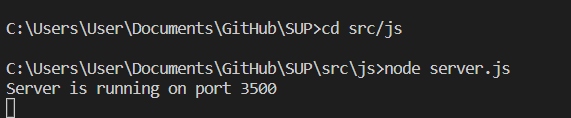

## Відображення всіх сутностей

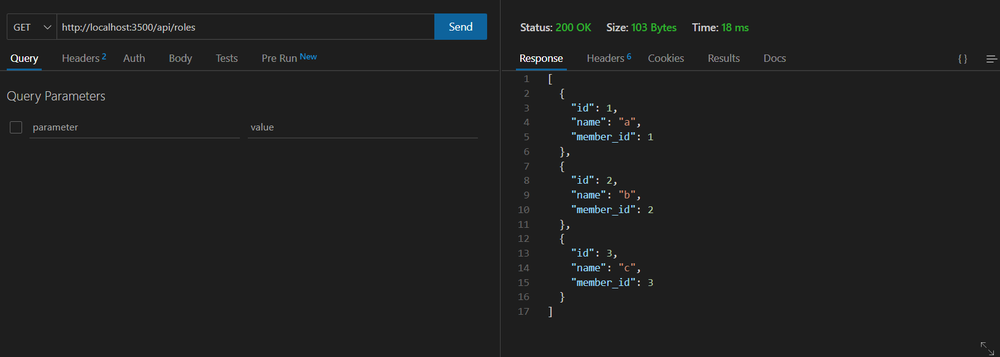

## Відображення сутності по заданому id

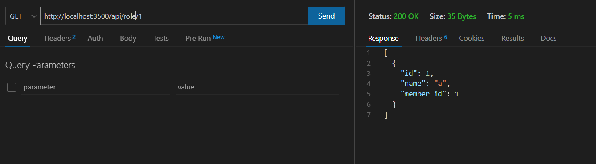

## Додавання сутності

### Запит

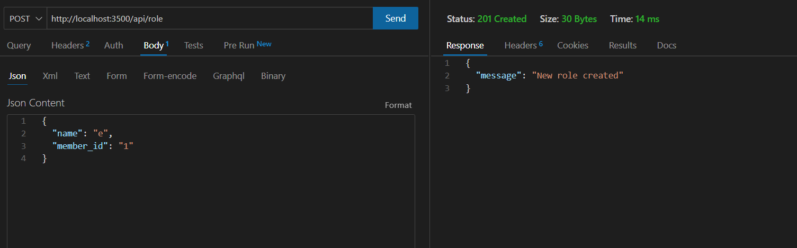

### Результат

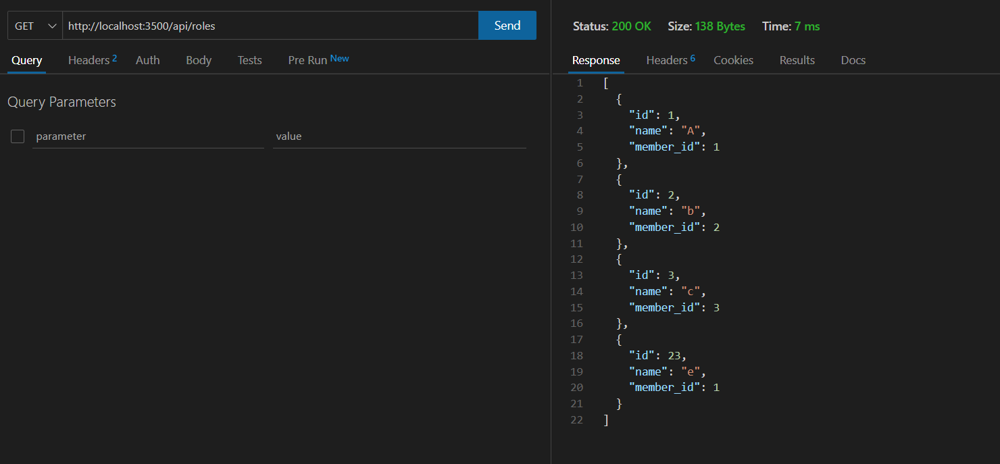

### Запит (існуююча сутність)

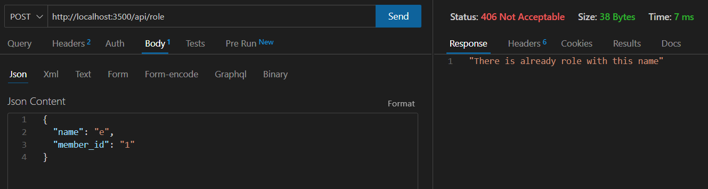

### Запит (існуююче ім'я сутності)

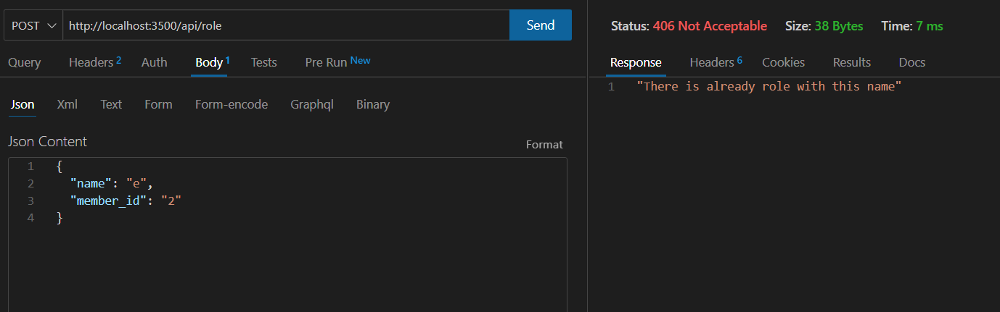

### Запит (недостатньо даних)

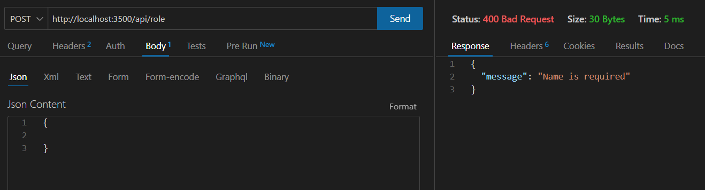

## Оновлення сутності

### Запит

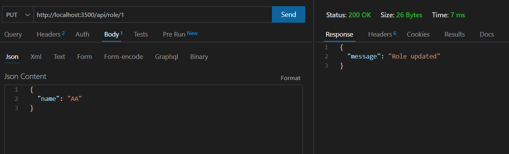

### Результат

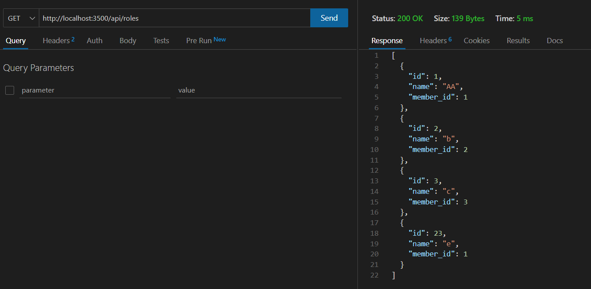

### Запит (неіснуююча сутність)

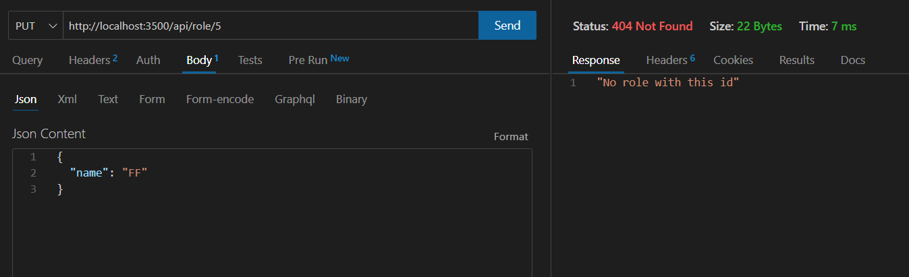

## Видалення сутності

### Запит

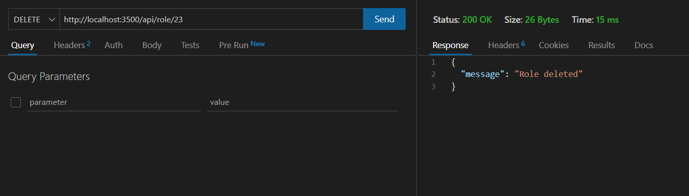

### Результат

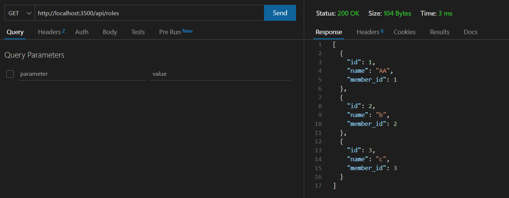

### Запит (неіснуюча сутність)

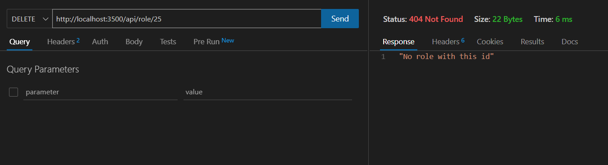

